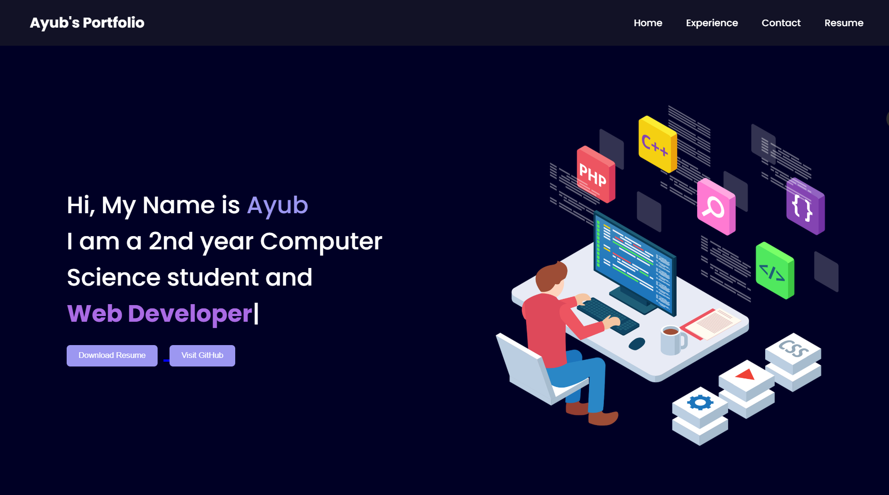

# 🌐 Ayub's Portfolio

Welcome to my personal portfolio website! 🚀
This project showcases my skills, projects, and experience as a **Computer Science student and developer**.

---

## 📌 About Me

Hi, I'm **Ayub** 👋

* 🎓 2nd Year Computer Science Student
* 💻 Passionate about Web Development & C Programming
* 🎨 Interested in UI Design and building clean interfaces

---

## 🛠️ Tech Stack

* **HTML5**
* **CSS3**
* **JavaScript**
* **Typed.js** (for typing animation)

---

## ✨ Features

* 🔥 Responsive design (mobile + desktop)
* 🎯 Smooth scrolling navigation
* ⚡ Typing animation in hero section
* 📄 Resume download option
* 🔗 Social media integration (GitHub, LinkedIn, Instagram)

---

## 📂 Sections Included

* **Home** – Introduction and quick links
* **Experience** – Skills and work overview
* **Contact** – Email and social links

---

## 📸 Preview



---

## 🚀 How to Run Locally

1. Clone this repository:

   ```bash
   git clone https://github.com/your-username/your-repo-name.git
   ```

2. Open the folder:

   ```bash
   cd your-repo-name
   ```

3. Run the project:

   * Open `index.html` in your browser

---

## 📥 Resume

You can download my resume directly from the website using the **Download Resume** button.

---

## 📬 Contact Me

* 📧 Email: [mdayubadil786@gmail.com](mailto:mdayubadil786@gmail.com)
* 💻 GitHub: https://github.com/Ayub-Adil
* 🔗 LinkedIn: https://www.linkedin.com
* 📸 Instagram: https://instagram.com

---

## 💡 Future Improvements

* Add real project showcase section
* Add dark/light mode toggle 🌗
* Improve animations and UI interactions
* Deploy with custom domain

---

## 📄 License

This project is open-source and free to use.

---

⭐ If you like this project, consider giving it a star on GitHub!
